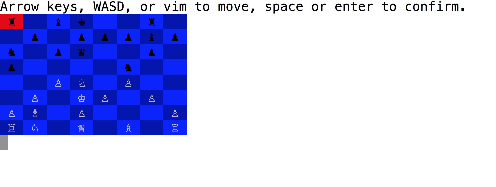

## Chess

Chess, written in Ruby, played in the terminal.



1. `git clone http://github.com/nevindnl/chess.git`
2. `cd chess`
3. `ruby chess.rb`

## Implementation
### Design
* [Piece][piece]
  * [Slideable][slideable]
    * [Bishop][bishop]
    * [Rook][rook]
    * [Queen][queen]
  * [Steppable][steppable]
    * [Knight][knight]
    * [King][king]
  * [Pawn][pawn]

Each piece stores a list of directions in which they can move. With the exception of the pawn, pieces either include a Slideable or Steppable module that generates a list of possible moves. The Piece superclass then filters these moves into valid moves, depending on whether they move a piece's own side into check.

* [Board][board]
  * Stores board, check/checkmate logic, and scoring logic.
* [Board][board]
  * Stores player interaction logic and computer AI.
* [Game][game]
  * Stores player interaction logic and computer AI.
* [Display][display]
  * Stores presentational logic.

  [piece]: ./lib/piece.rb
  [slideable]: ./lib/slideable.rb
  [steppable]: ./lib/steppable.rb
  [bishop]: ./lib/bishop.rb
  [rook]: ./lib/rook.rb
  [queen]: ./lib/queen.rb
  [knight]: ./lib/knight.rb
  [king]: ./lib/king.rb
  [board]: ./lib/board.rb
  [game]: ./lib/game.rb
  [display]: ./lib/display.rb

### AI
The computer AI uses a minimax algorithm with alpha-beta pruning.

```Ruby
# initialize alpha and beta to sentinels
def minimax player = @current_player, board = @board, move = nil, alpha = -102, beta = 102, level = 0
  # terminate at max level or if checkmate
  return {score: score(board), move: move} if level == @difficulty[@current_player.color] || score(board).abs == 101

  pieces = player.color == :white ? board.white_pieces : board.black_pieces
  pieces.shuffle!

  best_move = []

	# current_player maximizes
  if player == @current_player
    best_score = alpha

    #iterate through possible moves
    pieces.each do |piece|
      piece.valid_moves.each do |end_pos|
        # for each move:
        possible_move = [piece.pos, end_pos]

        # create board
        possible_board = board.dup
        possible_board.move(*possible_move)

        # recurse to find best score after move, updating upper bound
        possible_score = minimax(other_player(player), possible_board, possible_move, best_score, beta, level + 1)[:score]

        # terminate if score is greater than minimizer would allow
        if possible_score > beta
          return {score: beta, move: []}
        end

        # update best score
        if possible_score > best_score
          best_score = possible_score
          best_move = possible_move
        end
      end
    end

  # other player minimizes
  else
    best_score = beta

    pieces.each do |piece|
      piece.valid_moves.each do |end_pos|
        possible_move = [piece.pos, end_pos]

        possible_board = board.dup
        possible_board.move(*possible_move)

        # recurse to find best score after move, updating lower bound
        possible_score = minimax(other_player(player), possible_board, possible_move, alpha, best_score, level + 1)[:score]

        # terminate if score is less than maximizer would allow
        if possible_score < alpha
          return {score: alpha, move: []}
        end

        if possible_score < best_score
          best_score = possible_score
          best_move = possible_move
        end
      end
    end
  end

  {score: best_score, move: best_move}
end
```

Boards are scored using a weighted sum of the pieces on either side, plus or minus a value for check (scores in [-100, 100]). Checkmate returns sentinel scores (-101, 101).

```Ruby
# Game#score
def score board
  current_color = @current_player.color
  other_color = other_player.color

	# return
  board.score(current_color) - board.score(other_color)
end
```
```Ruby
# Board#score
def score color
  other_color = color == :white ? :black : :white

  # determine if checkmate
  if checkmate? color
    -101
  elsif checkmate? other_color
    101
  else
    # determine if check
    check =
      if in_check? color
        -20
      elsif in_check? other_color
        20
      else
        0
      end

    # add to weighted sum of pieces on board
    pieces(color).inject(0) do |score, piece|
      if piece.is_a? Pawn
        score + 1
      elsif piece.is_a? Knight
        score + 3
      elsif piece.is_a? Bishop
        score + 9
      elsif piece.is_a? Rook
        score + 12
      elsif piece.is_a? Queen
        score + 24
      else
        score
      end
    end + check
  end
end
```
