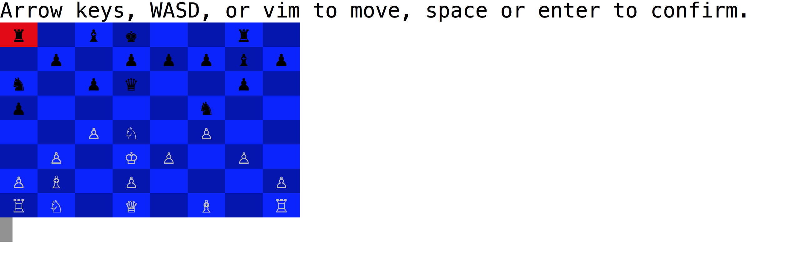

## Chess

1. `git clone http://github.com/nevindnl/chess.git`
2. `cd chess`
3. `ruby chess.rb`

Chess, written in Ruby, played in the terminal.



### Implementation
* [Piece][piece]
	* [Slideable][slideable]
		* [Bishop][bishop]
		* [Rook][rook]
		* [Queen][Queen]
	* [Steppable][steppable]
		* [Knight][knight]
		* [King][king]
	* [Pawn][pawn]

	Each piece stores a list of directions in which they can move. With the exception of the pawn, pieces either include a Slideable or Steppable module that generates a list of possible moves. The Piece superclass then filters these moves into valid moves, depending on whether they move a piece's own side into check.

* [Board][board]
  * Stores board, check/checkmate logic, and scoring logic.
* [Game][game]
  * Stores player interaction logic and computer AI.
* [Display][display]
  * Stores presentational logic.

  [piece]: ./lib/piece.rb
  [slideable]: ./lib/slideable.rb
  [steppable]: ./lib/steppable.rb
  [bishop]: ./lib/bishop.rb
  [rook]: ./lib/rook.rb
  [queen]: ./lib/queen.rb
  [knight]: ./lib/knight.rb
  [king]: ./lib/king.rb
  [board]: ./lib/board.rb
  [game]: ./lib/game.rb
  [display]: ./lib/display.rb

The computer AI uses a minimax algorithm with alpha-beta pruning.

```Ruby
tilt(i, j){
  function toLeft(){
    if (j !== 0){
      this.grid = Util.transpose(this.grid);
    }
    if (i + j > 0){
      this.grid = this.grid.map(row => row.reverse());
    }
  }

  function fromLeft(){
    if (i + j > 0){
      this.grid = this.grid.map(row => row.reverse());
    }
    if (j !== 0){
      this.grid = Util.transpose(this.grid);
    }
  }

  toLeft.call(this);
  this.leftTilt();
  fromLeft.call(this);
}

leftTilt(){
  this.grid = this.grid.map(row => {
    //remove spaces
    const tilted = row.filter(cell => cell.n !== -1);

    //merge
    let j = 0;
    while(j < tilted.length - 1){
      let [cell, nextCell] = tilted.slice(j, j + 2);

    if (cell.n === nextCell.n){
      cell.n += 1;
      cell.merged = true;
      tilted.splice(j + 1, 1);
    }

      j += 1;
    }

    //add space as needed
    while(tilted.length < this.size){
      tilted.push(new Cell(-1));
    }

    return tilted;
  });
}
```

DOM methods were used to render the grid,

```Javascript
drawGrid(){
  document.querySelectorAll('.grid-container div').forEach(div => {
    div.remove();
  });

  const grid = 	document.getElementsByClassName('grid-container')[0];
  const canvas = 	document.getElementsByTagName('canvas')[0];

  grid.style.width = this.dim + 'px';
  grid.style.height = this.dim + 'px';
  grid.style.border = `${this.gridBorder}px solid #${this.gridColor}`;
  canvas.width = this.dim;
  canvas.height = this.dim;

  const cellDim = this.cellDim - 2 * this.cellBorder + 'px';
  for (let i = 0; i < Math.pow(this.size, 2); i++){
    const div = document.createElement('div');
    div.style.width = cellDim;
    div.style.height = cellDim;
    div.style.border = `${this.cellBorder}px solid #${this.gridColor}`;
    grid.appendChild(div);
  }
}
```

whereas HTML5 Canvas was used to render individual cells.

```Javascript
draw(ctx, cellDim, base){
  if (this.n === -1){
    return;
  }

  let fontSize;
  if (cellDim <= 14){
    fontSize = 0;
  } else if (cellDim <= 23){
    fontSize = 4;
  } else if (cellDim <= 30){
    fontSize = 6;
  } else if (cellDim <= 40){
    fontSize = 8;
  } else if (cellDim <= 53){
    fontSize = 10;
  } else if (cellDim <= 77){
    fontSize = 14;
  } else {
    fontSize = 22;
  }

  const number = JSON.stringify(Math.round(Math.pow(base, this.n) * 100)/100);
  const dec = number.length - 4;

  fontSize = dec > 0 ? Math.floor(fontSize * Math.pow(.87, dec)) : fontSize;

  ctx.font = `100 ${fontSize}pt Arial`;
  ctx.textAlign = 'center';
  ctx.textBaseline = 'middle';

  const [x, y] = [this.j * cellDim, this.i * cellDim];

  ctx.fillStyle = this.n === 11 ? '#ffd700' : COLORS[this.n % 10];
  ctx.fillRect(x, y, cellDim, cellDim);

  ctx.fillStyle = 'white';
  ctx.fillText(number, x + cellDim / 2, y + cellDim / 2);
}
```
